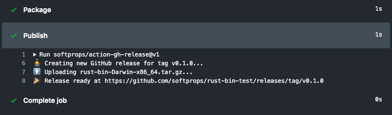

# action gh-release

[](https://github.com/technote-space/action-gh-release/actions)
[](https://codecov.io/gh/technote-space/action-gh-release)
[](https://www.codefactor.io/repository/github/technote-space/action-gh-release)
[](https://github.com/technote-space/action-gh-release/blob/master/LICENSE)

> A GitHub Action for creating GitHub Releases on Linux, Windows, and OSX virtual environments



> **⚠️ Note:** To use this action, you must have access to the [GitHub Actions](https://github.com/features/actions) feature. GitHub Actions are currently only available in public beta. You can [apply for the GitHub Actions beta here](https://github.com/features/actions/signup/).

## Table of Contents

<!-- START doctoc generated TOC please keep comment here to allow auto update -->
<!-- DON'T EDIT THIS SECTION, INSTEAD RE-RUN doctoc TO UPDATE -->
<details>
<summary>Details</summary>

- [🤸 Usage](#-usage)
  - [🚥 Limit releases to pushes to tags](#-limit-releases-to-pushes-to-tags)
  - [⬆️ Uploading release assets](#-uploading-release-assets)
  - [📝 External release notes](#-external-release-notes)
  - [💅 Customizing](#-customizing)

</details>
<!-- END doctoc generated TOC please keep comment here to allow auto update -->

## 🤸 Usage

### 🚥 Limit releases to pushes to tags

Typically usage of this action involves adding a step to a build that
is gated pushes to git tags. You may find `step.if` field helpful in accomplishing this
as it maximizes the resuse value of your workflow for non-tag pushes.

Below is a simple example of `step.if` tag gating

```yaml
name: Main

on: push

jobs:
  build:
    runs-on: ubuntu-latest
    steps:
      - name: Checkout
        uses: actions/checkout@v2
      - name: Release
        uses: technote-space/action-gh-release@v2
        if: startsWith(github.ref, 'refs/tags/')
```

You can also use push config tag filter

```yaml
name: Main

on:
  push:
    tags:
      - 'v*.*.*'

jobs:
  build:
    runs-on: ubuntu-latest
    steps:
      - name: Checkout
        uses: actions/checkout@v2
      - name: Release
        uses: technote-space/action-gh-release@v2
```


### ⬆️ Uploading release assets

You can can configure a number of options for your
GitHub release and all are optional.

A common case for GitHub releases is to upload your binary after its been validated and packaged.
Use the `with.files` input to declare a newline-delimited list of glob expressions matching the files
you wish to upload to GitHub releases. If you'd like you can just list the files by name directly.

Below is an example of uploading a single asset named `Release.txt`

```yaml
name: Main

on: push

jobs:
  build:
    runs-on: ubuntu-latest
    steps:
      - name: Checkout
        uses: actions/checkout@v2
      - name: Build
        run: echo ${{ github.sha }} > Release.txt
      - name: Test
        run: cat Release.txt
      - name: Release
        uses: technote-space/action-gh-release@v2
        if: startsWith(github.ref, 'refs/tags/')
        with:
          files: Release.txt
```

Below is an example of uploading more than one asset with a GitHub release

```yaml
name: Main

on: push

jobs:
  build:
    runs-on: ubuntu-latest
    steps:
      - name: Checkout
        uses: actions/checkout@v2
      - name: Build
        run: echo ${{ github.sha }} > Release.txt
      - name: Test
        run: cat Release.txt
      - name: Release
        uses: technote-space/action-gh-release@v2
        if: startsWith(github.ref, 'refs/tags/')
        with:
          files: |
            Release.txt
            LICENSE
```

> **⚠️ Note:** Notice the `|` in the yaml syntax above ☝️. That let's you effectively declare a multi-line yaml string. You can learn more about multi-line yaml syntax [here](https://yaml-multiline.info)

### 📝 External release notes

Many systems exist that can help generate release notes for you. This action supports
loading release notes from a path in your repository's build to allow for the flexibility
of using any changelog generator for your releases, including a human 👩‍💻

```yaml
name: Main

on: push

jobs:
  build:
    runs-on: ubuntu-latest
    steps:
      - name: Checkout
        uses: actions/checkout@v2
      - name: Generate Changelog
        run: echo "# Good things have arrived" > ${{ github.workflow }}-CHANGELOG.txt
      - name: Release
        uses: technote-space/action-gh-release@v2
        if: startsWith(github.ref, 'refs/tags/')
        with:
          body_path: ${{ github.workflow }}-CHANGELOG.txt
```

### 💅 Customizing

#### inputs

The following are *required* as `step.with` keys

| Name           | Description                          |
|----------------|--------------------------------------|
| `GITHUB_TOKEN` | GITHUB_TOKEN as provided by `secrets`|

The following are optional as `step.with` keys

| Name        | Type    | Description                                                     |
|-------------|---------|-----------------------------------------------------------------|
| `body`      | String  | Text communicating notable changes in this release              |
| `body_path` | String  | Path to load text communicating notable changes in this release |
| `prerelease`| Boolean | Indicator of whether or not is a prerelease                     |
| `files`     | String  | Newline-delimited globs of paths to assets to upload for release|
| `name`      | String  | Name of the release. defaults to tag name                       |

💡When providing a `body` and `body_path` at the same time, `body_path` will be attempted first, then falling back on `body` if the path can not be read from.

Doug Tangren (softprops) 2019  
Technote 2019
